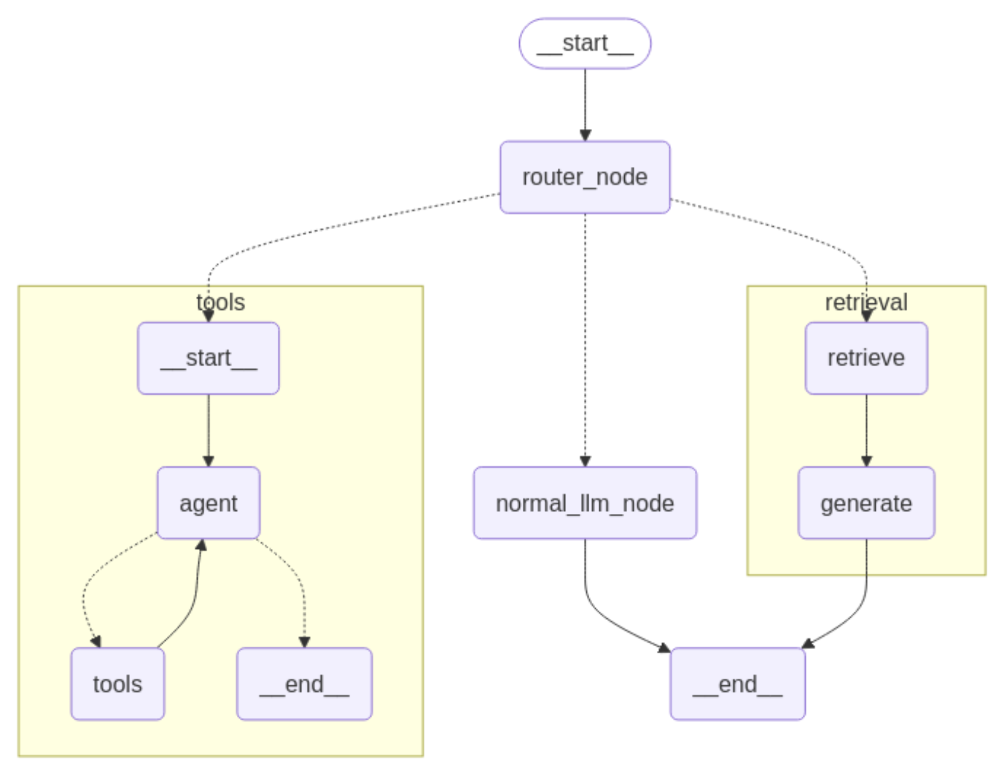

# LinkFusionAIAgent

How to run agent ai:

1. langgraph build -t linkfusionaiagent
2. docker compose up -d

---

# AIAGETN flow diagram

## How to setup local development environment?

## How to deploy in dev/production site?

